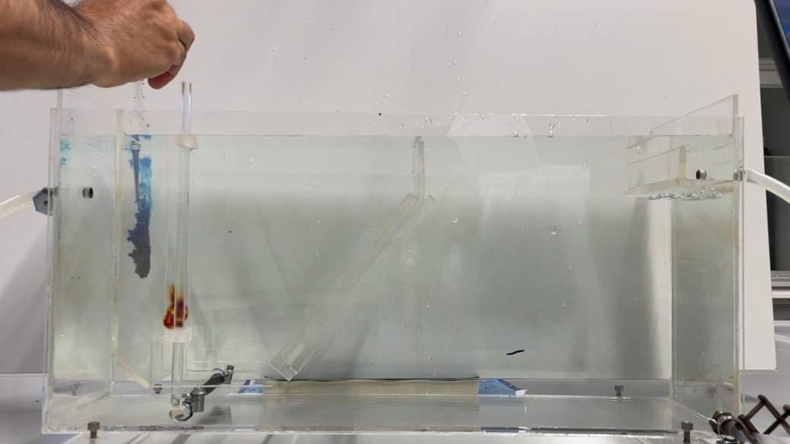
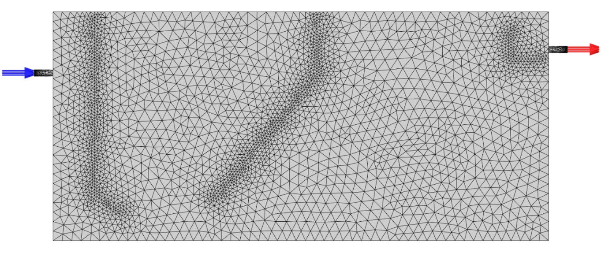
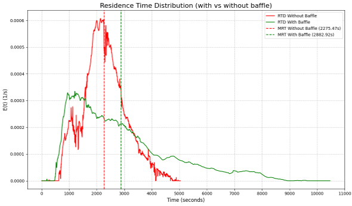

# Hydraulic Design of a Sedimentation Basin: Tracer Experiments and CFD in ANSYS Fluent

Study project (module MHSE09) in the M.Sc. Hydro Science and Engineering at TU Dresden, Chair of Process Engineering in Hydrosystems. Supervisor: Dr.-Ing. Masoud Haghshenasfard. I did this project together with Arjun Parajuli; we submitted the report on 3 September 2026.

> **Note on documentation:** The report is in English. This README summarises it and says which parts I did myself.

---

## Question

Sedimentation basins are designed as if water moved through them like a plug. In real basins, short-circuiting, recirculation and stagnant zones waste part of the volume. We asked: **how much does an internal baffle improve the flow in a small laboratory basin, and can a 3D CFD model reproduce what we measure?**

## Project overview

| | |
|---|---|
| **Basin** | Plexiglass model, 526 × 200 × 243 mm, volume 23.46 L |
| **Experiment** | Pulse of 0.5 mL methylene blue injected in front of the inlet; flow 460 mL/min; the run lasted about 175 minutes until the tracer had left the basin |
| **Measurement** | Video of the tracer, analysed frame by frame in FIJI (ImageJ) |
| **Model** | 3D CFD in ANSYS Fluent: single-phase, laminar, free-slip top surface, no energy equation |
| **Configurations** | Basin with and without a deflector baffle |
| **Output** | Residence time distribution (RTD) curves, hydraulic indicators, velocity fields, and a sensitivity study on inlet velocity |

## Who did what

This is taken from the acknowledgement in the report.

| Part | Author |
|---|---|
| Introduction, literature review, theoretical background | Fashli (me) |
| Laboratory experimental setup | Fashli (me) |
| Image processing in FIJI | Fashli (me) |
| CFD model configuration, mesh independence study | Fashli (me) |
| References | Fashli (me) |
| Experimental and numerical results and discussion: RTD analysis, model validation, velocity and pathline evaluation, operational sensitivity analysis | Arjun Parajuli |
| Conclusions and engineering implications | Arjun Parajuli |

The results below come from the shared report. The RTD analysis, the validation and the sensitivity study were written by my co-author.

---

## Method

### 1. Tracer experiment
We filled the basin at 460 mL/min until the flow was steady, injected the dye and filmed the basin until the dye had left. The theoretical detention time is τ = V/Q = 51.00 min.

### 2. From video to concentration (FIJI), my part
The dye absorbs light, so the brightness of the water changes with the dye concentration. We used mean light intensity in a region near the outlet as a proxy for concentration (Beer–Lambert law). The steps:

1. **Extract frames with adaptive timing:** 1 s intervals for the first 10 min (fast changes), 5 s up to 60 min (peak and main washout), 30 s for the slow tail up to 175 min.
2. **Select the area of interest** near the outlet, where there are fewer reflections from the plexiglass walls.
3. **Split the colour channels** and keep the channel where the dye absorbs most (the report uses the red channel).
4. **Invert** the image so that more dye means a higher value.
5. **Stack** the frames so every operation is applied to all frames in the same way.
6. **Subtract the background**, a frame taken before injection, to remove lighting gradients and reflections.
7. **Extract the mean grey value** of the region for each frame, giving a time series C(t) that is turned into the exit-age curve E(t).

### 3. CFD model, my part
- **Geometry:** the experimental basin, built in ANSYS Design Modeller.
- **Mesh independence:** velocity stopped changing noticeably above about 500,000 cells. I used **773,744 tetrahedral cells** with inflation layers in selected regions.
- **Physics:** single phase; free-slip top surface to imitate the free water surface; laminar flow because the inlet Reynolds number at 0.2 m/s is about 1,400 (below 2,000); temperature constant, so the energy equation is off.
- **Boundaries:** one water inlet and one tracer inlet, as in the experiment. A monitor at the outlet records the tracer mass fraction over time.
- **Run:** about 12–13 hours per simulation on an HPC cluster (16 tasks).

### 4. Hydraulic indicators
Mean residence time t̄ = ∫tE(t)dt, cumulative curve F(t) with t10 and t90, Morrill index M = t90/t10, dimensionless variance σ²/t̄², and the dead-zone fraction Vd/V = 1 − t̄/τ.

---

## Visual gallery

### Laboratory rig and CFD mesh

| Laboratory setup | CFD mesh (773,744 cells) |
|---|---|
|  |  |

### Residence time distribution curves
With the baffle the first peak is lower and the washout tail is much longer (see the results table below).



### Tracer transport in the CFD model


---

## Results

**Experiment (inlet velocity 0.20 m/s):**

| Indicator | Without baffle | With baffle |
|---|---|---|
| Mean residence time t̄ | 37.92 min | 48.05 min |
| Theoretical detention time τ | 51.00 min | 51.00 min |
| Peak time | 2255 s | 1185 s |
| Active volume fraction t̄/τ | 74.36% | 94.21% |
| Dead-zone volume | 6.01 L (25.64%) | 1.36 L (5.79%) |
| Morrill index t90/t10 | 2.64 | 5.59 |
| Dimensionless variance | 0.113 | 0.385 |

**CFD against experiment (baffled basin):**

| | Experiment | CFD | Difference |
|---|---|---|---|
| Peak time | 1184 s | 1320 s | below 12% |
| Mean residence time | 2883 s | 3045 s | below 6% |

**Inlet velocity study (CFD, 0.10 to 1.00 m/s):** the dead-zone fraction fell from about 40% to nearly 0%, while the Morrill index rose from about 2.5 to 7.7. A higher inlet velocity removes stagnant zones but increases back-mixing. At 0.10 m/s the jet is too weak to spread through the basin.

**What I take from it:**
- The baffle deflects the inlet jet downward, removes the bottom short-circuit and the large eddy above it, and brings the mean residence time close to the theoretical value.
- Changing the flow rate alone cannot optimise the basin, so geometry (the baffle) matters.
- A validated CFD model can be used to test designs before building them.

## Limitations

- One experimental run per configuration, with no repeats or error bars.
- Concentration comes from light intensity in a region near the outlet, not from samples of the outflow. The report does not describe a calibration of intensity against dye concentration.
- The dead-zone fraction is estimated from t̄ compared with τ; it is an index and not a direct measurement of stagnant volume.
- The CFD model was compared with the experiment only for the baffled basin at 0.20 m/s (peak time and mean residence time). The unbaffled model and the 0.10 to 1.00 m/s runs were not compared with experiments.
- The laminar model is justified at 0.2 m/s (Re about 1,400). With the same formula, the inlet Reynolds number would be about 4,200 at 0.6 m/s and 7,000 at 1.0 m/s, so the high-velocity runs are only indicative.
- In the experiment the baffled basin has a higher Morrill index and variance than the unbaffled one, meaning a longer tail. The report does not discuss this.
- The model is single-phase, with no settling particles. The study shows improved hydraulics, not measured removal of solids.

## Skills shown

- Setting up and documenting a 3D CFD model (geometry, mesh independence, boundary conditions, laminar model check) in ANSYS Fluent.
- Turning video into a measurement: adaptive frame sampling and background-corrected intensity in FIJI.
- Residence time distribution analysis and hydraulic indicators (with my co-author).
- Writing a technical report with a clear split of work.

## Folder contents

```text
.
├── README.md
├── documentation/   # report (see the note about confidentiality before adding it)
└── assets/          # figures used in this README
```

The `assets/` folder holds `laboratory-setup.png`, `mesh-generation.png`, `rtd-performance-curves.png` and `cfd-fluid-flow.gif`.

## Authors

Fashli Adli Wal Ikhsan · [github.com/fashliadli](https://github.com/fashliadli)
Arjun Parajuli (co-author)
